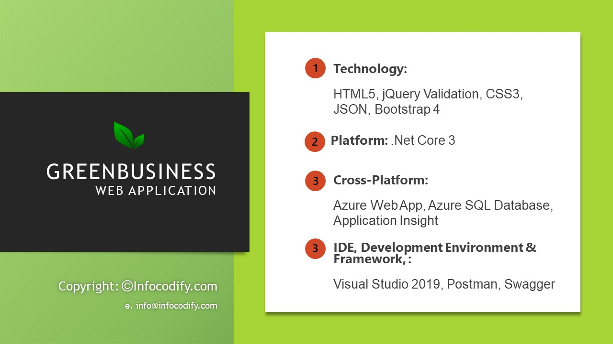

# GreenBusiness Web Application for Business \

  

1.  GreenBusiness Web Application for Business. You can Manage from your Admin dashboard your Blog posts, Careers positions, job applications, admin users, customer messages.

2.  This is not CMS but a powerful template in .Net Core 3, Bootstrap 4, CSS3, jQuery Validation, Azure Web Apps, Azure SQL Database, Azure Applications Insight. Developed and tested with visual studio 2019, tools and framework such as Chrome, Postman and Swagger.

3.  Clean code, Asynchronous request and communication, highest security and 92/100 Google page speed easily rank on google first page.

3.  Do you need a demo? Send a message and i will provide you the user account credentials to try yourself.

  Click the following link: https://greenbusiness.azurewebsites.net/

